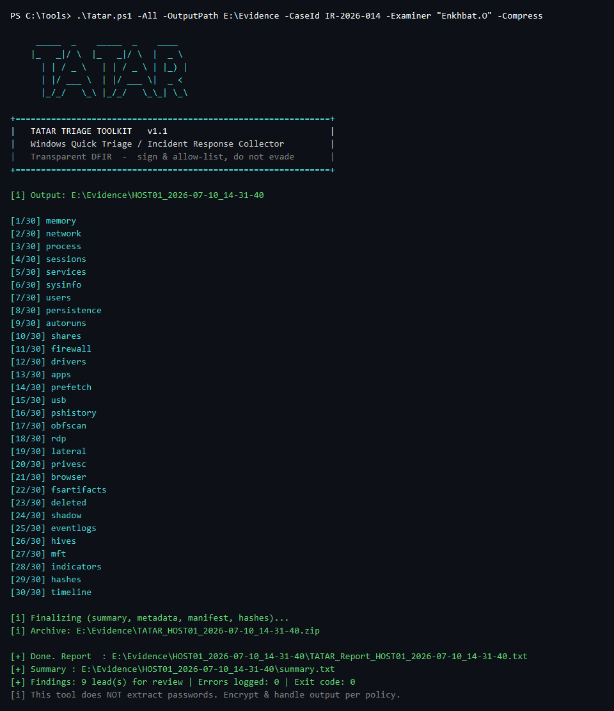
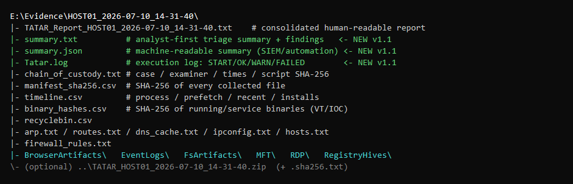
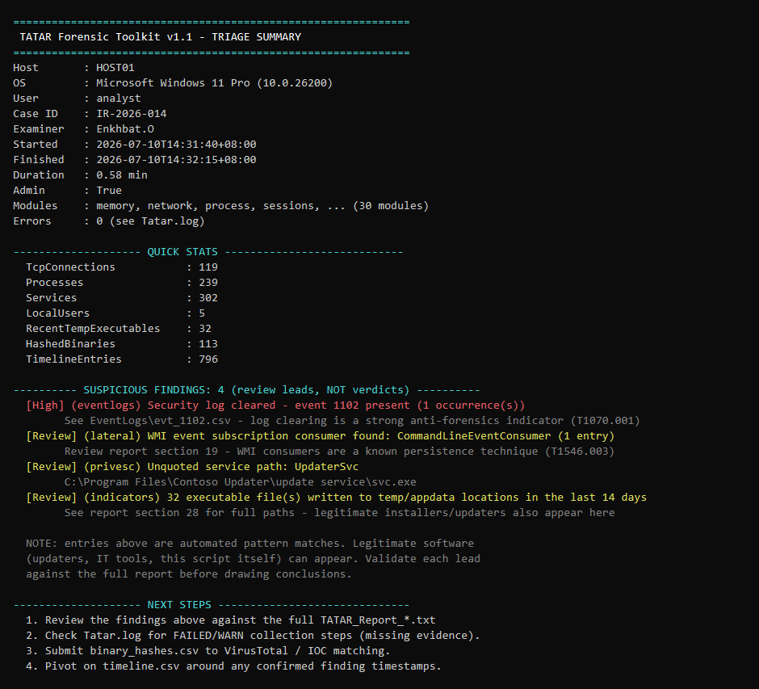
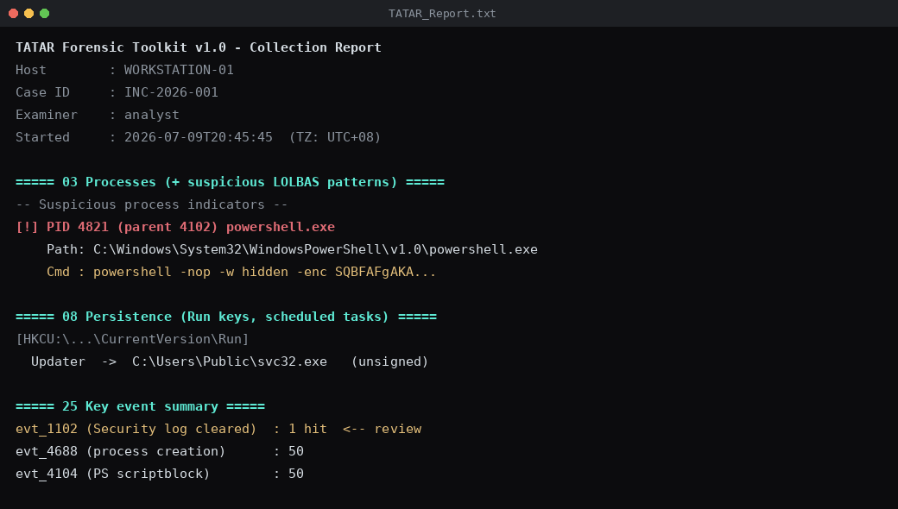

<p align="center">
  
</p>

<p align="center">
  <b>A fast, single-file Windows DFIR triage & artifact collector written in PowerShell.</b>
</p>

<p align="center">
  
  
  
  
  
  
  
</p>

---

When an endpoint shows signs of compromise (visited a malicious site, ran a suspicious file, unexplained slowness), you need to preserve evidence *quickly* — without installing or juggling a dozen separate tools. `Tatar.ps1` collects the important volatile and non-volatile artifacts from a Windows host in a single read-only-first pass and produces a consolidated report, an analyst-first **triage summary with aggregated findings**, a full **execution log**, and a SHA-256 manifest for chain of custody.

> Built for first responders and security analysts who need triage logs **fast**, on-scene, with minimal dependencies.

---

## Demo

Run everything with a single command:

<p align="center">
  
</p>

Every run produces a self-contained, hashed evidence folder:

<p align="center">
  
</p>

The v1.1 triage summary (`summary.txt`) gives the IR lead a one-page starting point:

<p align="center">
  
</p>

The consolidated report flags suspicious activity as it goes (sample):

<p align="center">
  
</p>

> Screenshots use sample/redacted data.

---

## Highlights

- **One script, no install.** Drop it on the host (or a USB), run it, done.
- **30 modules**, executed in **RFC 3227 order of volatility** (memory → network → processes → … → disk / registry / logs).
- **Analyst-first summary.** Every run writes `summary.txt` + `summary.json`: host/OS/case metadata, quick stats, and an aggregated **Suspicious findings** list — leads for review, *not* verdicts. The JSON feeds straight into SIEM / SOAR pipelines.
- **Execution log.** `Tatar.log` records every module with timestamps and `START / OK / WARN / FAILED` status — clean audit trail, easy troubleshooting.
- **Automation-friendly.** `-Silent` suppresses all console output (WinRM / scheduled / remote runs) and the script returns meaningful **exit codes** (see below).
- **Read-only first.** Destructive / heavy actions (memory dump, hive save, full EVTX) are **off by default** behind explicit switches.
- **Chain of custody.** Per-run metadata, examiner / case ID, and a SHA-256 manifest of every collected file.
- **Transparent by design.** No obfuscation, no AMSI/AV bypass. Meant to be code-signed and allow-listed on the forensic host.
- **Does NOT extract or decrypt passwords.**
- **Cross-platform.** Emits the shared [`summary.schema.json`](schema/summary.schema.json) contract; a [Linux edition](linux/) (`tatar-linux.sh`) produces identical `summary.json` outputs.

---

## Requirements

- Windows 10 / 11 (Server 2016+ works too)
- PowerShell 5.1+ (PowerShell 7 supported)
- **Administrator** recommended (some artifacts are incomplete without it)

---

## Usage

```powershell
# Allow the script for the current session
Set-ExecutionPolicy -ExecutionPolicy Bypass -Scope Process -Force

# Run everything (single- or double-dash both work)
.\Tatar.ps1 -All
.\Tatar.ps1 --all

# List available modules (no collection, no folder created)
.\Tatar.ps1 -List

# Run specific modules only
.\Tatar.ps1 -Modules network,process,rdp,lateral,timeline

# Full run to an external drive, with case metadata, compressed + hashed
.\Tatar.ps1 -All -OutputPath E:\Evidence -CaseId IR-2026-014 -Examiner "Enkhbat.O" -Compress

# Automated / remote run: no console output, check the exit code
.\Tatar.ps1 -All -Silent -OutputPath E:\Evidence -CaseId IR-2026-014
if ($LASTEXITCODE -ne 0) { Write-Warning "TATAR finished with issues - check Tatar.log" }
```

### Options

| Option | Description |
|--------|-------------|
| `-All` / `--all` | Run all modules |
| `-Modules a,b,c` | Run only the named modules |
| `-List` | List modules and exit |
| `-Help` | Show help and exit |
| `-OutputPath <path>` | Output base directory (default `C:\Forensic`; **prefer an external drive**) |
| `-CaseId <id>` | Case / incident ID for chain of custody |
| `-Examiner <name>` | Examiner name for chain of custody |
| `-Compress` | Zip + SHA-256 the output at the end |
| `-CollectHives` | Save SAM/SECURITY/SYSTEM/SOFTWARE + NTUSER (credential material; may trigger EDR) |
| `-ExportEvtx` | Export full `.evtx` logs |
| `-MemoryDump` | Raw memory image via `tools\winpmem.exe` (may trigger EDR) |
| `-Silent` / `-Quiet` | Suppress **all** console output (banner, progress, status). Files, including `Tatar.log`, are still written. For WinRM / scheduled / automated runs |

### Exit codes

| Code | Meaning |
|------|---------|
| `0` | Collection completed successfully |
| `1` | Fatal / usage error (nothing selected, output dir cannot be created, no valid modules) |
| `2` | Collection completed, but one or more steps logged errors — check `Tatar.log` |

---

## Modules

Order of volatility, top to bottom:

`memory` · `network` · `process` · `sessions` · `services` · `sysinfo` · `users` · `persistence` · `autoruns` · `shares` · `firewall` · `drivers` · `apps` · `prefetch` · `usb` · `pshistory` · `obfscan` · `rdp` · `lateral` · `privesc` · `browser` · `fsartifacts` · `deleted` · `shadow` · `eventlogs` · `hives` · `mft` · `indicators` · `hashes` · `timeline`

Coverage includes: system/user/network state, running processes with LOLBAS pattern flags, services & drivers, startup/Run-key/scheduled-task persistence, RDP activity, lateral-movement artifacts (SMB sessions, mapped drives, WMI persistence, PsExec), privilege-escalation indicators (unquoted service paths, `AlwaysInstallElevated`, token privileges), obfuscated-script scan, browser artifact metadata (all profiles, no decryption), Recent/Amcache/Prefetch, Recycle Bin, shadow copies, key Windows event IDs, optional registry hive & EVTX export, NTFS/MFT info, file hashing for IOC matching, and a lightweight super-timeline CSV.

---

## Triage summary & findings

Every run ends with an analyst-first one-pager so the IR lead knows **what to look at first**:

- **`summary.txt`** — host / OS / case metadata, quick stats (process count, TCP connections, local users, hashed binaries, …) and the aggregated **Suspicious findings** list, sorted by severity.
- **`summary.json`** — the same data as structured JSON (`stats`, `findings[]` with `Severity/Category/Message/Detail`), ready for SIEM ingestion or scripted post-processing.

Findings come from the collectors themselves: LOLBAS-style command lines, obfuscated-script matches, PsExec artifacts, WMI event-subscription consumers, unquoted / user-writable service paths, `AlwaysInstallElevated`, security-log-cleared (1102) events, executables recently dropped in temp locations, and more.

> **Important:** findings are automated pattern matches — **leads for review, not verdicts**. Legitimate software (updaters, IT tooling) regularly appears; validate each lead against the full report before drawing conclusions.

## Execution log (`Tatar.log`)

Each run writes a timestamped execution log alongside the evidence:

```
[2026-07-10 22:26:16.693] [START ] module sysinfo (1/30)
[2026-07-10 22:26:17.721] [OK    ] module sysinfo finished in 1s
[2026-07-10 22:26:17.751] [START ] module hives (26/30)
[2026-07-10 22:26:17.995] [ERROR ] Hives failed: Access denied
[2026-07-10 22:26:17.996] [WARN  ] module hives finished in 0.2s with 1 error(s)
```

`Tatar.log` is an *operational* log (it keeps growing after the manifest is hashed), so it is deliberately **excluded from `manifest_sha256.csv`**. Evidence files are all hashed as usual.

---

## MITRE ATT&CK mapping

Each collector maps to the adversary techniques it helps **detect / investigate**. Full detail in [`docs/MITRE_ATTACK.md`](docs/MITRE_ATTACK.md).

| Module / artifact | ATT&CK technique | Tactic |
|---|---|---|
| `process` (LOLBAS command lines) | T1059 · T1059.001 (PowerShell) | Execution |
| `persistence` (Run keys) | T1547.001 | Persistence |
| `persistence` (scheduled tasks) | T1053.005 | Persistence |
| `services` | T1543.003 | Persistence / Priv Esc |
| `rdp` | T1021.001 (RDP) | Lateral Movement |
| `lateral` (SMB shares / sessions) | T1021.002 | Lateral Movement |
| `lateral` (WMI event subscription) | T1546.003 · T1047 | Persistence / Execution |
| `lateral` (PsExec) | T1569.002 | Execution |
| `hives` (SAM / SECURITY / LSASS) | T1003.002 · T1003.001 | Credential Access |
| `privesc` (unquoted service path) | T1574.009 | Persistence / Priv Esc |
| `privesc` (AlwaysInstallElevated) | T1548 | Privilege Escalation |
| `obfscan` | T1027 · T1140 | Defense Evasion |
| `usb` | T1091 · T1200 | Initial Access / Exfil |
| `eventlogs` (ID 1102) | T1070.001 (clear event logs) | Defense Evasion |
| `shadow` | T1490 (inhibit recovery) | Impact |
| `network` / `hosts` | T1071 · T1565.001 | C2 / Defense Evasion |
| `browser` | T1555.003 · T1539 | Credential Access |

---

## Output

```
C:\Forensic\<HOST>_<YYYY-MM-DD_HH-mm-ss>\
├─ TATAR_Report_<HOST>_<stamp>.txt   # consolidated human-readable report
├─ summary.txt                       # analyst-first triage summary + findings  (NEW v1.1)
├─ summary.json                      # same, machine-readable (SIEM/automation) (NEW v1.1)
├─ findings.json                     # findings-only feed for SOAR / SIEM              (NEW)
├─ Tatar.log                         # execution log: START/OK/WARN/FAILED      (NEW v1.1)
├─ chain_of_custody.txt              # case/examiner/times/script hash
├─ manifest_sha256.csv               # SHA-256 of every collected file (Tatar.log excluded)
├─ timeline.csv                      # process / prefetch / recent / installs
├─ binary_hashes.csv                 # SHA-256 of running/service binaries (VT/IOC)
├─ recyclebin.csv
├─ arp.txt / routes.txt / dns_cache.txt / ipconfig.txt / hosts.txt
├─ firewall_rules.txt
├─ BrowserArtifacts\ · EventLogs\ · FsArtifacts\ · RDP\ · RegistryHives\ · MFT\
└─ (optional) ..\TATAR_<HOST>_<stamp>.zip (+ .sha256.txt)
```

---

## Handling & operational notes

- **Prefer an external drive** (`-OutputPath E:\Evidence`). Writing to the system drive can overwrite deleted-file evidence.
- **Do not reboot / shut down** the host before collection finishes.
- The output can contain **sensitive data** (registry hives, browser metadata). Encrypt the archive and transfer it securely.
- Some modules (`hives`, `memorydump`, `exportevtx`) are known to trigger EDR/AV. This is expected — **coordinate with your SOC and allow-list the tool in advance** rather than disabling EDR.

### Getting past AV without evading it

This tool is intentionally **transparent** (no obfuscation / AMSI bypass). To run it without AV interference the correct, auditable way:

1. **Code-sign** the script (`Set-AuthenticodeSignature`).
2. **Publish its SHA-256** so responders can verify and allow-list it.
3. On the forensic host, add a **scoped Defender/EDR exclusion** for the tool, and remove it afterward.

`SHA-256 (Tatar.ps1): A69F953AFCE102190DA9928869D380528F6E2BB7E203C66CF46E97187709219B`

---

## Known limitations

- Does **not** extract or decrypt saved passwords.
- Full `$MFT` parsing requires an offline tool (e.g. MFTECmd / RawCopy); the script records NTFS/MFT metadata only.
- Browser artifacts are **metadata only** (no DB execution, no decryption).
- Without Administrator, some artifacts (event logs, hives, protected processes) are incomplete.
- Findings in `summary.txt` / `summary.json` are heuristic pattern matches — expect false positives from legitimate software; always validate.
- `Compress-Archive` on PowerShell 5.1 struggles with very large outputs (e.g. memory images); use 7-Zip for those.

## Optional external tools (`tools\`)

- `winpmem.exe` — memory imaging (for `-MemoryDump`)
- `autoruns64.exe` — Sysinternals Autoruns (for the `autoruns` module)

If present in a `tools\` subfolder they are used automatically; otherwise those steps are skipped.

---

## Changelog

### Tier 1 hardening (current)
- **Persistence ASEPs**: IFEO Debugger hijack, AppInit_DLLs, AppCertDlls, Winlogon Shell/Userinit, LSA packages, Print monitors (read-only registry).
- **Process genealogy**: parent -> child tree + suspicious-lineage findings (Office/script host spawning a shell).
- **More event IDs**: 4698/4699 (task), 4719 (audit policy), 4648 (explicit creds), 4768/4769/4776 (Kerberos/NTLM), 5140 (share), 4627.
- **`findings.json`** findings-only output for SOAR/SIEM.
- **MITRE sub-techniques** in the mapper (e.g. T1059.001 vs T1059.003, T1218.x LOLBINs, T1546.x ASEPs).
- **Robustness**: winpmem HVCI/empty-image detection; manifest hashing tolerates locked files (`-ErrorAction SilentlyContinue`).
- **Exit-code accuracy**: expected live-system locks (Amcache.hve, active NTUSER.DAT) are now logged as NOTE/WARN (not errors), so a clean run returns exit 0 instead of 2.

### Schema 1.1 — cross-platform (current)
- **Unified `summary.json` schema** ([`schema/summary.schema.json`](schema/summary.schema.json)) now shared with the Linux edition; consumers key off `schemaVersion`.
- Findings carry a **MITRE ATT&CK `technique[]`** array (centralized mapping); the summary shows the IDs inline.
- New **`environment`** block: virtualization, container, security module.
- Field names unified across platforms: `privileged` (was `administrator`), `durationSeconds` (was `durationMinutes`); finding keys lowercased.
- Companion **[`linux/tatar-linux.sh`](linux/)** added — 16 modules, same analyst-first outputs.

### v1.1
- **Triage summary** (`summary.txt` + `summary.json`): metadata, quick stats, aggregated *Suspicious findings* (review leads, not verdicts); JSON for SIEM/automation.
- **Execution log** (`Tatar.log`): timestamped `START/OK/WARN/FAILED` per module, errors mirrored with reasons; excluded from the evidence manifest by design.
- **`-Silent` / `-Quiet`** mode for WinRM / scheduled / remote runs + **exit codes** (`0` ok, `1` fatal, `2` completed with errors).
- False-positive fixes: obfuscation scan skips the script itself; word-boundary matching for `nc.exe` / `ncat` / `iex` patterns (no more `AdobeCollabSync.exe` hits).
- Hostname fallback when `$env:COMPUTERNAME` is unset.

### v1.0
- Initial release: 30 collectors in RFC 3227 order of volatility, chain of custody, SHA-256 manifest, optional zip, hive/EVTX/memory switches.

---

## Legal

For **authorized** use only — on systems you own or have explicit written permission to examine. You are responsible for complying with applicable laws and organizational policy.

## Author

**Enkhbat.O** — Security Analyst

## License

MIT (see `LICENSE`).
