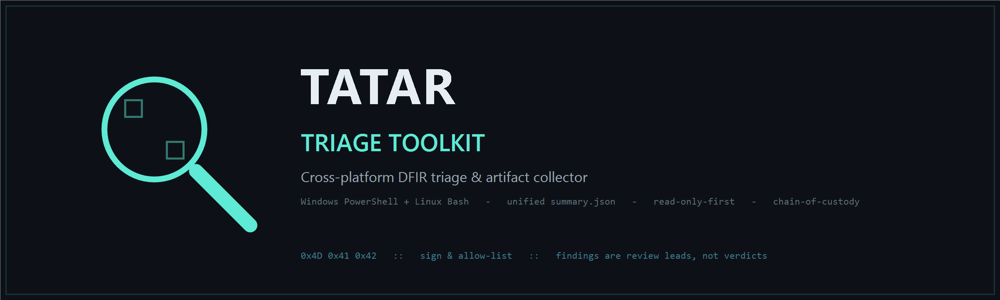

<p align="center">
  
</p>

<p align="center">
  <b><a href="README.md">English</a> · <a href="README_MN.md">Монгол</a></b>
</p>

<p align="center">
  <b>Хурдан, нэг файлт, cross-platform DFIR triage / artifact цуглуулагч — Windows (PowerShell) + Linux (Bash).</b>
</p>

<p align="center">
  
  
  
  
  
</p>

---

Халдлагад өртсөн шинж тэмдэг гарсан (хортой сайт зочилсон, сэжигтэй файл ажиллуулсан, тайлбаргүй удааширсан) үед нотлох баримтыг **хурдан** хамгаалж авах хэрэгтэй болдог — олон тусдаа хэрэгсэл суулгаж чирэгдэлгүйгээр. `Tatar.ps1` (Windows) болон `tatar-linux.sh` (Linux) нь системийн чухал volatile ба non-volatile artifact-уудыг **read-only-first** нэг дамжлагаар цуглуулж, шинжээчид зориулсан нэгдсэн тайлан, MITRE ATT&CK тэмдэглэгээ, chain-of-custody-тай SHA-256 manifest үүсгэнэ.

> Хээрийн нөхцөлд, минимал хамааралтайгаар triage лог хурдан гаргах шаардлагатай эхний хариу үзүүлэгч, security шинжээчдэд зориулав.

---

## Triage гэж юу вэ?

Triage гэдэг ойлголт эмнэлгээс гаралтай. Эмч өвчтөнд хамгийн эхний үнэлгээг хурдан хийж, ямар эрсдэл байж болох, цааш ямар гүнзгий шинжилгээ хэрэгтэйг тодорхойлдог. **Tatar Triage-ийн зорилго ч мөн адил** — бүх forensic хэрэгслийг орлох биш, Incident Response-ийн эхний шатанд чухал мэдээллийг хурдан цуглуулж, шинжээчид дараагийн алхмаа зөв тодорхойлоход туслах юм.

Энэ хэрэгсэл нь:
- Malware analyzer шиг sandbox-д malware **шинжилдэггүй**.
- Volatility шиг memory dump авч гүнзгий шинжилгээ **хийдэггүй**.
- Autopsy зэрэг full-disk forensic **хийдэггүй**.

Харин системийн одоогийн төлөв байдлыг хурдан үнэлж, хамгийн чухал мэдээлэл болон эрсдэлийг ялган харахад тусална.

---

## Онцлох боломжууд

- **Нэг скрипт, суулгах шаардлагагүй.** Хост дээр (эсвэл USB-д) хийгээд шууд ажиллуулна.
- **Windows 30 / Linux 18 модуль**, RFC 3227 order of volatility дарааллаар (санах ой → сүлжээ → процесс → … → диск / registry / лог).
- **Шинжээч-төвтэй тайлан.** Run бүр `summary.txt` + `summary.json` + `findings.json` гаргана — host/OS/case мета, quick stats, нэгтгэсэн **Сэжигтэй findings** жагсаалт. JSON нь SIEM/SOAR-т шууд ордог.
- **Гүйцэтгэлийн лог** (`Tatar.log`/`tatar.log`) — модуль бүрийн `START/OK/WARN/FAILED`.
- **Read-only-first.** Хүнд/эвдрэлтэй үйлдлүүд (memory dump, hive save, EVTX export) default-оор унтраалттай, тодорхой тугаар л асна.
- **Chain of custody.** Run бүрийн мета, examiner/case ID, файл бүрийн SHA-256 manifest.
- **Ил тод.** Обфускаци, AV/AMSI bypass үгүй. Гарын үсэг зурж, allow-list хийхэд зориулсан.
- **Cross-platform.** Windows, Linux хоёр нэг [`summary.schema.json`](schema/summary.schema.json) гэрээ гаргана — нэг parser хоёуланг уншина.
- **Нууц үг задалдаггүй.** Илэрсэн зүйлс нь **review хийх сэжүүр, эцсийн дүгнэлт биш.**

---

## Нууцлал

Tatar Triage бүрэн **офлайн** ажиллана. Цуглуулсан мэдээлэл, scan үр дүн, хэрэглэгчийн өгөгдлийг ямар нэг сервер рүү **илгээдэггүй**.

---

## Шаардлага

- Windows 10 / 11 (Server 2016+ бас ажиллана) · PowerShell 5.1+ (PowerShell 7 дэмжинэ)
- Linux: Debian/Ubuntu эсвэл RHEL/CentOS/Fedora (bash 4+, coreutils)
- Бүрэн цуглуулгад **Administrator / root** зөвлөж байна.

---

## Ашиглах

```powershell
# Windows
Set-ExecutionPolicy -ExecutionPolicy Bypass -Scope Process -Force
.\Tatar.ps1 -All -OutputPath E:\Evidence -CaseId IR-2026-014 -Examiner "Enkhbat.O" -Compress
.\Tatar.ps1 -List          # модулиудыг харах
.\Tatar.ps1 -All -Silent   # автоматжуулалт (exit code буцаана)
```

```bash
# Linux
chmod +x tatar-linux.sh
sudo ./tatar-linux.sh --all --output /mnt/usb/evidence --caseid IR-2026-014 --examiner "Enkhbat.O"
./tatar-linux.sh --list
```

**Exit code:** `0` = амжилт · `1` = fatal/usage алдаа · `2` = алдаатай дууссан (лог шалга).

---

## Модулиуд

**Windows (30):** memory · network · process · sessions · services · sysinfo · users · persistence · autoruns · shares · firewall · drivers · apps · prefetch · usb · pshistory · obfscan · rdp · lateral · privesc · browser · fsartifacts · deleted · shadow · eventlogs · hives · mft · indicators · hashes · timeline

**Linux (18):** sysinfo · network · process · sessions · users · services · persistence · apps · suid · sshkeys · bashhistory · kernelmods · indicators · hashes · logs · timeline · containers · integrity

Хамрах хүрээ: систем/хэрэглэгч/сүлжээний төлөв, LOLBAS command-line флагтай процессууд, process genealogy, persistence (Run keys, scheduled tasks, IFEO/AppInit/LSA/Winlogon ASEP-ууд), RDP/lateral movement, privilege-escalation индикатор, обфускаци скан, browser artifact мета, Recent/Amcache/Prefetch, shadow copy, чухал Windows event ID, NTFS/MFT, IOC-д зориулсан file hashing, super-timeline. Linux талд: cron/systemd persistence, SUID/SGID, SSH түлхүүр, container/cloud context, критикал файлын integrity baseline гэх мэт.

---

## Гаралт

```
<OutputPath>/<HOST>_<YYYY-MM-DD_HH-mm-ss>/
├─ TATAR_Report_<HOST>_<stamp>.txt   # нэгдсэн, хүн уншихад зориулсан тайлан
├─ summary.txt                       # шинжээч-төвтэй triage дүгнэлт + findings
├─ summary.json                      # нэгдсэн schema (SIEM/автоматжуулалт)
├─ findings.json                     # findings-only feed (SOAR/SIEM)
├─ Tatar.log                         # гүйцэтгэлийн лог: START/OK/WARN/FAILED
├─ chain_of_custody.txt              # case/examiner/цаг/скриптийн hash
├─ manifest_sha256.csv               # файл бүрийн SHA-256
├─ timeline.csv · binary_hashes.csv · ...
└─ (optional) TATAR_<HOST>_<stamp>.zip (+ .sha256)
```

---

## Анхаарах зүйлс

- **Гадаад дискэнд бичихийг зөвлөнө** (`-OutputPath E:\Evidence`). Систем дискэнд бичвэл устсан файлын ул мөрийг дарж бичиж болзошгүй.
- Цуглуулга дуусахаас өмнө хостыг **унтраах/restart хийхгүй**.
- Гаралт нь **эмзэг мэдээлэл** агуулж болзошгүй (registry hive, browser мета) — шифрлэж, аюулгүй дамжуулна уу.
- Зарим модуль (`hives`, `memorydump`, `exportevtx`) EDR/AV-г идэвхжүүлж болзошгүй — SOC-той зөвшилцөж, tool-оо урьдчилан allow-list хий.

Дэлгэрэнгүй MITRE ATT&CK mapping: [`docs/MITRE_ATTACK.md`](docs/MITRE_ATTACK.md).

---

## Хязгаарлалт

- Хадгалагдсан нууц үг **задалдаггүй / тайлдаггүй**.
- Бүрэн `$MFT` parse хийхэд offline хэрэгсэл (MFTECmd / RawCopy) хэрэгтэй; скрипт зөвхөн NTFS/MFT мета бичнэ.
- Browser artifact бол **зөвхөн мета** (DB задлахгүй).
- Findings нь эвристик хэв тааралт — хууль ёсны программаас FP гарч болно, **үргэлж баталгаажуул**.

---

## Холбоо барих

**Зохиогч:** Enkhbat Oyunbayar — Security Analyst · Улаанбаатар

[](https://www.facebook.com/enkhbat.o/)
[](https://github.com/ochmunkh)

Зөвхөн **зөвшөөрөлтэй** хэрэглээнд — өөрийн эзэмшлийн буюу бичгээр зөвшөөрөл авсан системд ашиглана уу.

## Лиценз

MIT (`LICENSE`-г үзнэ үү).
