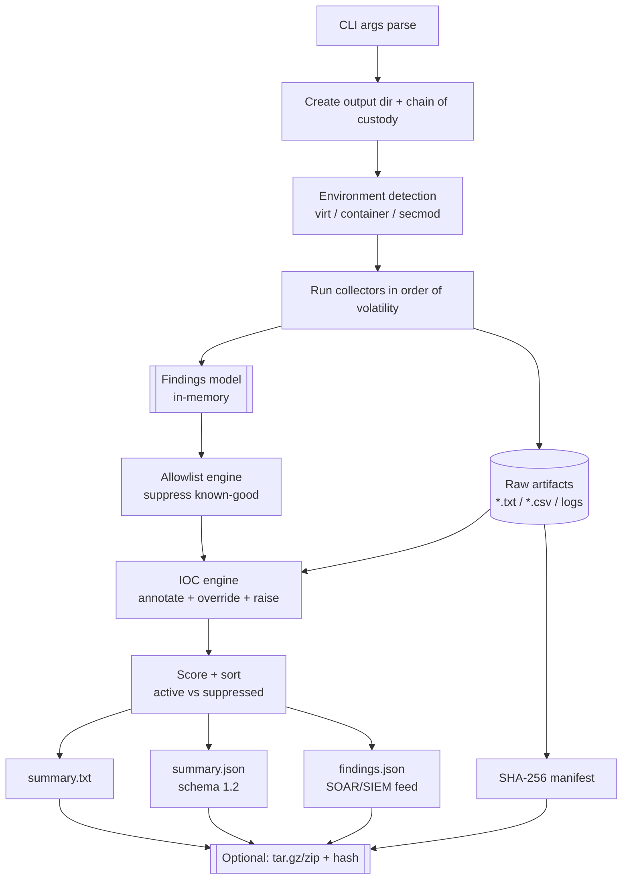
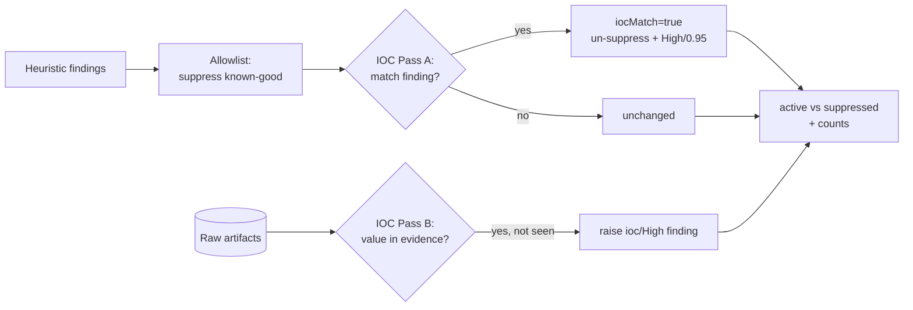

# TATAR Triage Toolkit — System Architecture

> Technical reference for how TATAR collects, scores, and reports host triage
> data. Audience: DFIR analysts, detection engineers, and reviewers who need to
> understand (and trust) what the tool does before running it on evidence.

TATAR is a **single-file, dependency-light triage collector** shipped in two
parity editions that share one output contract:

| Edition | File | Runtime | Modules |
|---|---|---|---|
| Windows | `Tatar.ps1` | PowerShell 5.1+ | 30 collectors |
| Linux   | `linux/tatar-linux.sh` | Bash 4+ / coreutils | 18 collectors |

Both emit the **same unified schema** (`schema/summary.schema.json`, currently
`schemaVersion 1.2`) so a SIEM/SOAR pipeline ingests either platform identically.

---

## 1. Design principles

1. **Read-only first.** Collectors observe; they never install packages, change
   config, or modify security settings. The only writes are into the output
   directory (and opt-in memory carving behind an explicit flag).
2. **Order of volatility (RFC 3227).** Modules run most-volatile first —
   memory/network/process → sessions → services → persistence → disk/logs →
   derived artifacts (timeline, hashes, integrity).
3. **Transparent, not evasive.** No AMSI/AV bypass, no obfuscation. TATAR is
   meant to be read, signed, and allow-listed by the defenders running it.
4. **Findings are leads, not verdicts.** Every automated match is a review lead
   with an explicit confidence and MITRE ATT&CK mapping — never a conviction.
5. **Cross-platform parity.** One schema, one findings model, one allowlist/IOC
   contract across Windows and Linux.

---

## 2. High-level data flow



Collectors write two things at once: **raw evidence** to disk (for the human
report) and **structured findings** to an in-memory list. The findings list is
what the allowlist and IOC engines operate on; the raw artifacts are what the
IOC engine's "raise" pass scans.

---

## 3. The findings model

Every finding is a record with a stable shape across both platforms. On Windows
it is a `[pscustomobject]`; on Linux it is a Unit-Separator-delimited row that is
serialized to the same JSON object:

```jsonc
{
  "id": "TTR-F-007",            // stable per-run sequence id
  "severity": "High",           // High | Review
  "category": "process",        // module domain
  "technique": ["T1059.001"],   // MITRE ATT&CK ids
  "message": "…short lead…",
  "detail": "…evidence / path / cmdline…",
  "confidence": 0.7,            // 0.7 High, 0.4 Review, 0.95 IOC-confirmed
  "suppressed": false,          // hidden from headline by allowlist
  "suppressReason": "",         // why it was suppressed
  "iocMatch": false             // confirmed against an IOC feed
}
```

Confidence is deliberately coarse — it encodes *how the finding was produced*
(heuristic vs. IOC-confirmed), not a false precision. Suppressed findings are
**kept** in the report and JSON (with a reason) for audit; they are only removed
from the active headline count.

### Linux field-separator note

Bash `read` treats TAB as whitespace-IFS and collapses consecutive delimiters,
which would silently drop empty fields (empty detail/technique/reason) and shift
every later column. The Linux edition therefore delimits the findings pipeline
with the **ASCII Unit Separator (0x1F)**, a non-whitespace control character that
never appears in collected text. This is a correctness requirement, not a style
choice.

---

## 4. Signal-to-noise: the allowlist engine

Raw heuristics over a healthy host produce mostly false positives (vendor
binaries in odd places, signed updaters, the OS's own tooling). The allowlist
engine suppresses **known-good** findings *before* they reach the analyst.

An allowlist is JSON with three (Windows) / three (Linux) trust signals:

```jsonc
{
  "paths":      ["C:\\Windows\\System32\\*", "/usr/bin/*"],  // glob match
  "publishers": ["Microsoft Corporation"],                    // Windows Authenticode
  "hashes":     [],                                           // exact SHA-256
  "packageOwned": true                                        // Linux: dpkg/rpm ownership
}
```

Matching logic, per finding, in priority order:

| Signal | Windows | Linux |
|---|---|---|
| **Path glob** | extract `C:\…\*.exe/dll/sys/…` from message+detail, `-like` each glob | extract first absolute path, shell `case` glob |
| **Publisher** | `Get-AuthenticodeSignature` → `Valid` + subject match | — (not applicable) |
| **Package owner** | — | `dpkg -S` / `rpm -qf` returns a package ⇒ vendor-trusted |
| **Hash** | SHA-256 of the referenced file ∈ `hashes[]` | same |

A match sets `suppressed = true` and records the reason. Nothing is deleted.
Result on a clean host in testing: **11 raw findings → 4 active / 7 suppressed.**

---

## 5. Detection: the IOC engine

The IOC engine layers *known-bad* intelligence on top. An IOC feed is offline
JSON:

```jsonc
{ "hashes": [...], "ips": [...], "domains": [...], "filenames": [...] }
```

It runs in two passes, **after** the allowlist:

**Pass A — annotate & override.** For each existing finding, match its
message/detail against string IOCs (ip/domain/filename, case-insensitive) or the
referenced binary's SHA-256 against hash IOCs. A hit:
- sets `iocMatch = true`,
- **overrides the allowlist** — re-activates a suppressed finding
  (`suppressed = false`),
- escalates to `severity = High`, `confidence = 0.95`,
- prefixes the detail with `IOC match: <value>`.

The override is the key rule: *a known-bad indicator always beats a known-good
allowlist entry.* An allow-listed System32 binary that matches an IOC hash comes
back to the top of the report.

**Pass B — raise.** Scan the collected raw artifacts for any IOC value not
already tied to a finding in Pass A, and raise a new `ioc` / High finding
("IOC observed in collected evidence: …"). This catches indicators that appear
in netstat output, process command lines, or file listings even when no
heuristic fired. Pass B is deduplicated against Pass A so an indicator is
reported once.



---

## 6. Output contract

Written to `OUTDIR = <base>/<host>_<timestamp>/` every run:

| File | Purpose |
|---|---|
| `TATAR_Report_*.txt` / report | full human-readable evidence dump |
| `summary.txt` | analyst-first triage summary: stats, active findings, suppressed (audit), next steps |
| `summary.json` | full run metadata + findings, `schemaVersion 1.2` |
| `findings.json` | findings-only feed for SOAR/SIEM ingestion |
| `manifest_sha256.txt` | SHA-256 of every collected file |
| `chain_of_custody.txt` | case id, examiner, timestamps, script hash |
| `tatar.log` / `Tatar.log` | timestamped START/OK/WARN/FAILED per module |

`summary.json` / `findings.json` both carry `findingsCount`,
`activeFindingsCount`, and `suppressedCount` so a dashboard can chart
signal-to-noise directly.

### Exit codes

`0` = success · `1` = fatal / usage error · `2` = completed with errors
(a collector failed; evidence may be partial — check the log).

---

## 7. Trust & safety boundaries

- **No exfiltration.** TATAR makes no network calls. IOC and allowlist feeds are
  local files; hash lookups are computed locally, never submitted anywhere.
- **Least privilege.** Runs unprivileged with reduced coverage; root/Admin only
  broadens what can be *read*, never what is changed.
- **Auditable.** The script's own SHA-256 is recorded in the chain of custody,
  and the tool is designed to be diffed, signed, and allow-listed by the SOC.
- **Opt-in risk.** Anything that could trip EDR or touch deleted data
  (memory dump, hive collection, deleted-binary carving) is behind an explicit
  flag and off by default.

---

## 8. CI / validation

GitHub Actions gates every push:
- **Linux:** `bash -n` syntax, `shellcheck`, a live run, and `jsonschema`
  validation of the emitted `summary.json` against `schema/summary.schema.json`.
- **Windows:** PowerShell tokenizer parse, `PSScriptAnalyzer` (errors), a live
  run, and JSON validation.

Schema evolution is additive: `schemaVersion` is an enum (`["1.1","1.2"]`) and
the v2 finding fields (`id`, `confidence`, `suppressed`, `suppressReason`,
`iocMatch`) are optional, so 1.1 consumers keep working.

---

## 🇲🇳 Товч тайлбар (монголоор)

TATAR бол ганц файлаас ажилладаг, гадны хамааралгүй triage хэрэгсэл. Windows
дээр `Tatar.ps1` (30 модуль), Linux дээр `tatar-linux.sh` (18 модуль) ажиллах ба
хоёул адилхан гаралт — нэг ижил JSON schema (`schemaVersion 1.2`) — үүсгэдэг.
Тиймээс SIEM/SOAR аль ч платформын үр дүнг ялгалгүй уншиж чадна.

Ажиллах дараалал нь ийм: эхлээд аргумент уншиж, гаралтын хавтас болон chain of
custody-г бэлдэнэ. Дараа нь ажиллаж буй орчноо (виртуал уу, контейнер уу, ямар
хамгаалалттай вэ) тодорхойлж, модулиудаа **алдагдамтгай өгөгдлийн дарааллаар**
(санах ой, сүлжээ, процесс → диск, лог) ажиллуулна. Модуль бүр хоёр зүйл
зэрэг гаргана: хүн уншихад зориулсан түүхий нотолгоог диск рүү, машин уншихад
зориулсан finding-ийг санах ойд.

Дараа нь хоёр давхарга шүүлт орно. **Allowlist** нь урьдаас мэдэгдэж байгаа "цэвэр"
зүйлсийг (System32, Defender, багц эзэмшлээр батлагдсан хоёртын файл гэх мэт)
нууна — устгахгүй, аудитад зориулж шалтгаантайгаар нь хажуу тийш нь тавьдаг.
**IOC** давхарга нь эсрэгээрээ мэдэгдэж байгаа "муу" зүйлсийг тэмдэглэнэ; хэрэв
IOC таарвал тэр finding нь allowlist-ийг **давж**, High/0.95 болж дээшилдэг, мөн
цуглуулсан нотолгооноос олдсон шинэ IOC-д зориулж нэмэлт finding босгоно. Эцэст нь
идэвхтэй/нуугдсан гэж эрэмбэлээд `summary.txt`, `summary.json`, `findings.json`,
SHA-256 manifest-ээ бичнэ.

Гурван гол зарчим: **зөвхөн уншина** (систем өөрчлөхгүй), **ил тод** (нуухгүй,
AV/AMSI тойрохгүй), **finding бол дүгнэлт биш, харин шалгах ёстой сэжүүр**.
Ямар ч мэдээллийг гадагш явуулахгүй — allowlist, IOC хоёулаа offline файл, хэш
дотооддоо бодогдоно. Exit code: `0` = амжилттай, `1` = алдаа/буруу хэрэглээ,
`2` = зарим алхам алдаатай дууссан.
